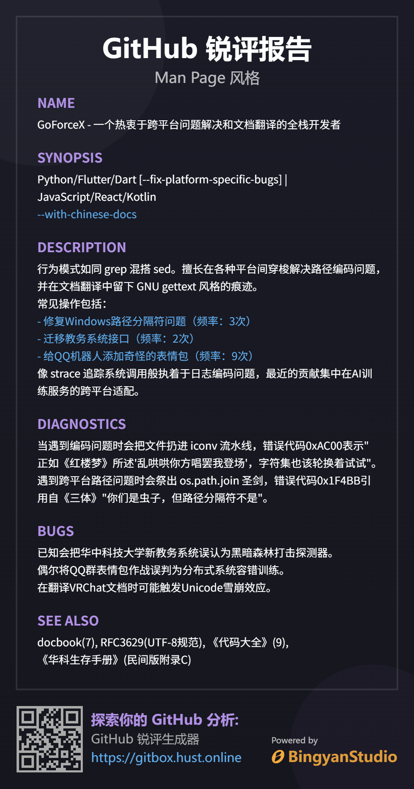

<div align="center">
<h3 style="border-bottom: none;">GitHub Analyzer | GitHub 锐评生成器</h3>
<p>锐评一下你都在 GitHub 写了什么</p>
<p><a href="https://gitbox.hust.online">体验地址</a> |
<a href="docs/selfhost.md">Docker 部署</a> </p>
</div>

## 项目介绍

本项目旨在分析 GitHub 上的项目和用户活动，通过 AI 生成有趣的评论和总结。

## 功能

1. 生成 GitHub 锐评
2. 生成图片报告以供分享
3. 支持自部署！

## 看看效果？



## Star History

<a href="https://star-history.com/#BingyanStudio/github-analyzer&Date">
 <picture>
   <source media="(prefers-color-scheme: dark)" srcset="https://api.star-history.com/svg?repos=BingyanStudio/github-analyzer&type=Date&theme=dark" />
   <source media="(prefers-color-scheme: light)" srcset="https://api.star-history.com/svg?repos=BingyanStudio/github-analyzer&type=Date" />
   
 </picture>
</a>

# LICENSE

```
MIT License

Copyright (c) 2025 Bingyan Studio

Permission is hereby granted, free of charge, to any person obtaining a copy
of this software and associated documentation files (the "Software"), to deal
in the Software without restriction, including without limitation the rights
to use, copy, modify, merge, publish, distribute, sublicense, and/or sell
copies of the Software, and to permit persons to whom the Software is
furnished to do so, subject to the following conditions:

The above copyright notice and this permission notice shall be included in all
copies or substantial portions of the Software.

THE SOFTWARE IS PROVIDED "AS IS", WITHOUT WARRANTY OF ANY KIND, EXPRESS OR
IMPLIED, INCLUDING BUT NOT LIMITED TO THE WARRANTIES OF MERCHANTABILITY,
FITNESS FOR A PARTICULAR PURPOSE AND NONINFRINGEMENT. IN NO EVENT SHALL THE
AUTHORS OR COPYRIGHT HOLDERS BE LIABLE FOR ANY CLAIM, DAMAGES OR OTHER
LIABILITY, WHETHER IN AN ACTION OF CONTRACT, TORT OR OTHERWISE, ARISING FROM,
OUT OF OR IN CONNECTION WITH THE SOFTWARE OR THE USE OR OTHER DEALINGS IN THE
SOFTWARE.
```
